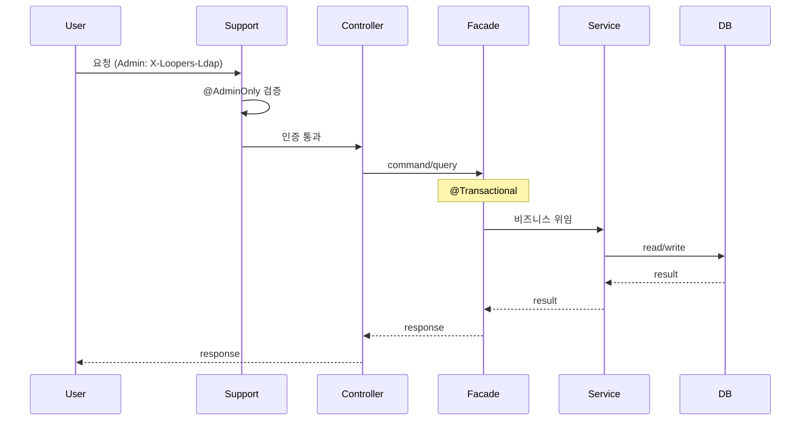

## 📌 Summary

- **배경**: 유저 기능(회원가입/조회/비밀번호 변경) 구현 이후, 브랜드·상품·좋아요·장바구니·주문 도메인의 설계가 필요했고, 설계 문서(01~04)가 정리된 뒤 어드민 API·장바구니·주문 도메인을 코드로 옮길 단계에 있음.
- **목표**: 요구사항을 분석해 구체화하여 설계 문서(요구사항 정리, 시퀀스·클래스 다이어그램, ERD)를 작성하고, 구현 전 설계 문서를 작성함으로써 구현 시 문제가 발생할 경우 빠르게 대응할 수 있도록 함.
- **결과**: .docs/design 폴더 내 각 문서를 통해 유저 시나리오·비즈니스 규칙·예외 정책·도메인 모델·DB 스키마·동시성 전략 등 구현에 필요한 의사결정을 사전에 확정했고, 어드민 진입점·권한 분리, 주문 생성(일괄 검증·재고는 결제 시 차감)·취소(재고 복구 실패 시 롤백), Cart 검증 단일화, ERD FK 미사용 원칙을 문서에 반영했음.

---

## 🧭 Context & Decision

### 문제 정의

### 1. Orders — 주문 생성

- 현재 동작/제약: 주문 생성 시 재고는 "확인"만 수행하며 실제 차감은 하지 않음. 요구사항 3.1(즉시 차감)을 '결제 완료 시점'으로 해석하여 설계됨.

- 문제(또는 리스크):
    - 주문 생성과 결제 사이의 시차로 인해 결제 시점에 재고 부족 발생 가능성.
    - 요구사항 3.2(삭제 상품 주문 불가)의 명확한 반영 필요.
    - 반복문 내 개별 조회로 인한 N번의 호출 및 트랜잭션 장기화.

- 성공 기준(완료 정의): validateProducts를 통한 일괄 검증(Bulk)으로 N+1 문제 해결 및 3.2 반영. 결제 시 재고 부족에 대한 처리(실패/취소)를 시퀀스에 명시하고 Facade 수준의 트랜잭션 경계 확립.

### 2. Orders — 주문 취소

- 현재 동작/제약: 주문 취소 시 상태 변경(CANCELLED)과 재고 복구를 동시에 수행. 요구사항 4.3에 따라 주문 미존재와 타인 주문을 구분 없이 404(NOT_FOUND) 처리.

- 문제(또는 리스크): 
    - 재고 복구 실패 시 주문 상태와 실제 재고 간의 데이터 정합성 불일치 리스크.

- 성공 기준(완료 정의): 재고 복구 실패 시 전체 롤백을 통해 정합성 보장. 서비스 레이어 전반에 4.3 정책(NOT_FOUND 통일) 일관 적용.

### 선택지와 결정

### 1. 주문 생성 정책

- 고려한 대안:
    - 대안 A: 재고 예약(선점) 시스템 도입. 미결제 시 타임아웃 배치를 통한 예약 해제 필요 (복잡도 높음).
    - 대안 B: 주문 생성 시 확인만 수행, 결제 시 차감 시도 후 부족 시 주문 실패 처리.

- 최종 결정: 대안 B. 시스템 단순성을 유지하고, 결제 플로우 내 비관적 락을 통해 동시성 및 정합성 보장.

- 트레이드오프: 예약 인프라 없이 단순함을 얻었으나, 사용자가 결제 단계에서 최종적으로 실패를 경험할 수 있는 UX 리스크 존재.

### 2. 주문 취소 및 재고 복구 정책

- 고려한 대안:
    - 대안 A: 재고 복구 실패 시에도 상태는 취소로 유지하고 배치를 통한 사후 보정.
    - 대안 B: 재고 복구 실패 시 전체 롤백 처리.

- 최종 결정: 대안 B. "취소 = 상태 변경 + 재고 복구"를 하나의 원자적 단위로 관리하여 정합성 우선.

- 추후 개선 여지: Soft Delete 처리된 상품의 복구 스킵 등 ProductService 내 방어 로직을 보강하여 롤백 발생 가능성을 최소화함.

## 🏗️ Design Overview

### 변경 범위

- **영향 받는 모듈/도메인**: commerce-api — support(권한·인증), interfaces/api(brand, product, like, cart, order), application·domain·infrastructure 각 도메인.

- **신규 추가**: Admin API 진입점(도메인별 `XxxAdminV1Controller` 또는 단일 Admin 컨트롤러 내 엔드포인트), support 쪽 `@AdminOnly`·인터셉터, Cart·Orders 도메인(장바구니 옵션 수정, 주문 생성/취소), ERD·시퀀스 문서 반영 코드.

- **제거/대체**: 없음(기존 Customer API 유지).

### 주요 컴포넌트 책임
- **support(auth/security)**: 어드민 권한 검증(`@AdminOnly`, 인터셉터/필터). 매 요청 1회 검사; 침입 대응은 토큰 수명·폐기(Revocation)·캐시 정책으로 보완.

- **도메인별 Controller**: Customer용 `XxxV1Controller`, Admin용 `XxxAdminV1Controller`(또는 단일 Admin 컨트롤러 내 메서드). 둘 다 **동일한 도메인 Facade**만 호출.

- **도메인별 Facade**: 트랜잭션 경계·플로우 조율만. 비즈니스 로직 없음. Customer/Admin 구분 없이 1개.

- **ProductService**: `validateProductAvailability`(Cart 1회 검증), `validateProducts(orderItemRequestList)`(Orders Bulk 검증: 존재·미삭제·재고). 재고 차감/복구는 결제·취소 플로우에서 호출.

- **OrderService**: 주문 생성 시 `validateProducts` → 스냅샷·저장(재고 차감 없음); 취소 시 본인/상태 검증 후 `ProductService.restoreStock` → 실패 시 롤백. 4.3 반영: 주문 없음·타인 주문 구분 없이 NOT_FOUND.

## 🔁 Flow Diagram

### Main Flow

- **변경 목적**: 어드민 요청이 support에서 한 번 검증된 뒤 도메인 Controller → Facade → Service로만 흐르는지 확인.

- **핵심 변경점**: 권한은 support, 리소스·비즈니스는 기존 도메인 레이어 재사용. Cart는 `validateProductAvailability` 1회, Orders는 `validateProducts` Bulk·결제 시 재고 차감·취소 시 재고 복구 후 상태 변경.

- **리스크/주의사항**: 주문 생성~결제 사이 재고 소진 시 결제 단계에서 실패/취소 처리. 재고 복구 실패 시 취소 전체 롤백.

- **테스트/검증**: 권한 실패는 support 단위/통합 1회; 도메인 E2E는 어드민 헤더로 200/201 검증. Cart/Orders 시퀀스는 통합·E2E로 검증.

## 💬 리뷰 포인트

멘토님께서 중점적으로 봐주시면 좋을 부분과, 설계하면서 고민했던 내용을 정리했습니다.

### 1. 어드민 설계: 도메인 분리 vs 권한 중심 확장

- **고민**: 어드민 기능을 위해 별도 도메인/파사드를 만들면 의존성이 복잡해지는 리스크가 있었습니다.

- **검토한 대안**

    - **A**: domain/admin 또는 application만 두고 AdminFacade가 Brand/Product/Order 서비스를 모두 호출 → 도메인 증가 시 의존성이 한곳에 몰림.

    - **B**: 도메인 패키지 안에 customer·admin을 나누되 모델·서비스·Facade 공유, 권한만 `@AdminOnly` + support에서 처리.

    - **C**: **어드민 전용 도메인 없이** support에 AdminAuthService, `@AdminOnly`, 인터셉터만 두고, 브랜드/상품/주문 등은 **각 도메인**에 Admin 전용 Controller(또는 단일 Admin 컨트롤러에 엔드포인트만 추가). 동일한 BrandFacade/ProductFacade/OrderFacade 사용.

- **선택: C**
    - “어드민 = 진입점 + 권한”만 두고, 리소스는 각 도메인에만 두는 것이 레이어 규칙에 맞고, 도메인 추가 시 해당 패키지에 AdminController만 추가하면 되어 확장 시 의존성 집중을 피할 수 있음. (Controller/Facade 재사용)
    
    - 권한 검증은 **support에서 한 번만** 단위/통합 테스트하고, 각 도메인 E2E는 어드민 헤더로 200/201만 검증하면 됨.
    
    - “어드민인지 한 번만 검사해도 되나?”에 대해: 침입 대응은 “한 요청 안에서 여러 번 검사”가 아니라 **요청마다 검사 + 짧은 토큰/세션 수명 + 폐기(Revocation) + 캐시 정책**으로 보완하는 것이 맞다고 정리. 필터에서 매 요청 1회 검사하면, 토큰 폐기·권한 박탈 시 **다음 요청부터** 차단되므로 1회 검사로 충분하다고 봄.

- **질문**: 공통 모듈(support)에 정의된 권한 계층 구조와 도메인별 Admin Controller 체계를 활용하고자 합니다. 이 경우, 필터 계층에서의 단일 검증만으로도 충분한 보안성을 확보할 수 있을지, 해당 설계 방식의 보안적 유효성에 대해 어떻게 생각하시는지 궁금합니다.

---

### 2. 주문/장바구니 로직 최적화 및 정합성

**변경 요약**

| 구간 | 기존 | 수정 | 이유 |
|------|------|------|------|
| **Cart** | 판매상태/재고 개별 검증 (2회) | `validateProductAvailability(productId, quantity, optionId)` 1회 | 레이스 구간 축소, 트랜잭션/호출 수 감소 |
| **Orders 생성** | 루프 내 개별 조회 (N회) | `validateProducts` 1회 Bulk 검증 | N번 조회 제거, 트랜잭션 단축 |
| **Orders 취소** | 재고 복구 실패 → 롤백만 표현 | 원자적 롤백 + 방어 로직 | 데이터 불일치 복구 실패 최소화 |

### [주요 설계 결정 및 고민]
- **장바구니**: 검증 원자성 확보
    - **고민**: 두 번의 ProductService 호출 사이에 상품 상태/재고가 바뀌는 **레이스** 가능성, 트랜잭션·커넥션 유지 시간 증가.

    - **선택**: `validateProductAvailability` 한 번으로 묶어 (A). “이 상품·옵션·수량으로 수정 가능한가”를 한 검증 단위로 두고, 실패 원인은 ProductService 반환(예외/에러코드)으로 구분. 검증 순서는 내부에서 “판매 중지 → 재고/옵션” 유지해 사용자 메시지를 명확히 함.

- **주문 생성**: 성능과 단순성 사이의 트레이드오프
    - **고민**: 
        - (1) 주문 생성 시에는 재고만 “확인”하고 차감하지 않음 → 결제 전 다른 주문이 재고를 쓰면 **결제 완료 시점에 재고 부족** 가능. 
        - (2) 요구사항 3.2 “삭제된 상품 주문 불가” 반영. 
        - (3) 루프 안 조회로 N번 호출·긴 트랜잭션.

    - **선택**:  
        - 요구사항 3.2를 반영해 삭제된 상품은 즉시 NOT_FOUND 처리하며, 결제 시점에 재고가 부족할 경우 주문을 실패/취소 처리하는 정책을 명시했습니다.
        - **성능**: `validateProducts(orderItemRequestList)` 한 번으로 N번 조회 제거. Facade에 `@Transactional`로 경계 명시.

- **주문 취소**: 재고 복구 실패 시 전체 롤백
    - **고민**: 
        - 재고 복구(restoreStock) 실패 시 전체 롤백하면 “결제 취소(환불)는 됐는데 주문 취소가 안 됨” 같은 불일치 인지 가능성.
        
    - **선택**: 
        - 전체 롤백을 통해 '상태 변경'과 '재고 복구'를 하나의 트랜잭션으로 묶었습니다.
        - 방어 로직: ProductService에서 복구 불가능한 케이스(예: 영구 삭제 등)를 사전에 스킵하여 롤백 발생 빈도를 최소화했습니다.

**질문**: Cart 1회 검증, Orders Bulk 검증·B안(결제 시 재고 차감)·취소 시 롤백+방어 로직, 4.3 통일이 요구사항·트랜잭션 경계와 맞는지 봐주시면 감사하겠습니다.

---

### 3. ERD: 물리적 FK(외래키) 미사용 결정

멘토님 말씀을 반영해, **FK 제약은 두지 않고 참조 컬럼만 유지**하는 방향으로 설계했습니다. FK를 쓰지 않는 이유와 선택 가능한 방법을 정리했습니다.

- **FK를 사용할 때 생길 수 있는 문제**

    - **스키마/배포 순서**: FK가 있으면 참조되는 테이블 먼저 배포·마이그레이션 순서 관리가 필요해, 테이블 분리·이름 변경·DB 분리(마이크로서비스 등) 시 제약이 됨.

    - **삭제 정책과 불일치**: Brand/Product는 **soft delete**라 DB CASCADE와 맞지 않고, 연쇄 삭제는 앱에서 처리하기로 한 설계(04-erd)와 맞추려면 FK CASCADE를 쓰기 어렵고, RESTRICT만 쓸 경우 “실수로 물리 삭제하는 것”만 막는 용도에 그침.

    - **확장성**: 나중에 테이블 분리·서비스 분리 시 FK가 걸림돌이 될 수 있음.

- **선택**: 
    - 모든 테이블에서 물리적 FK 제약을 제거하고 참조 컬럼만 유지합니다. "04-erd"의 “참조 정합성은 서비스 레이어에서 검증”, “연쇄·삭제는 앱에서 처리”와 맞추고, 마이그레이션·스키마 변경 유연성을 위해 참조 컬럼만 두고 FK는 생성하지 않기로 했습니다. 비즈니스 제약(예: UNIQUE(user_id, product_id))은 그대로 유지합니다.
    - Soft Delete 정책과의 충돌을 방지하고, 향후 마이크로서비스 전환이나 DB 분리 시 유연성을 확보하기 위함입니다. 참조 정합성은 애플리케이션(Service) 레이어에서 책임집니다.

**질문**: 데이터 정합성 보장을 앱 책임으로 돌리는 선택이 실무에서 마이그레이션이나 운영상 문제가 발생할 수 있는지 봐주시면 좋겠습니다.
