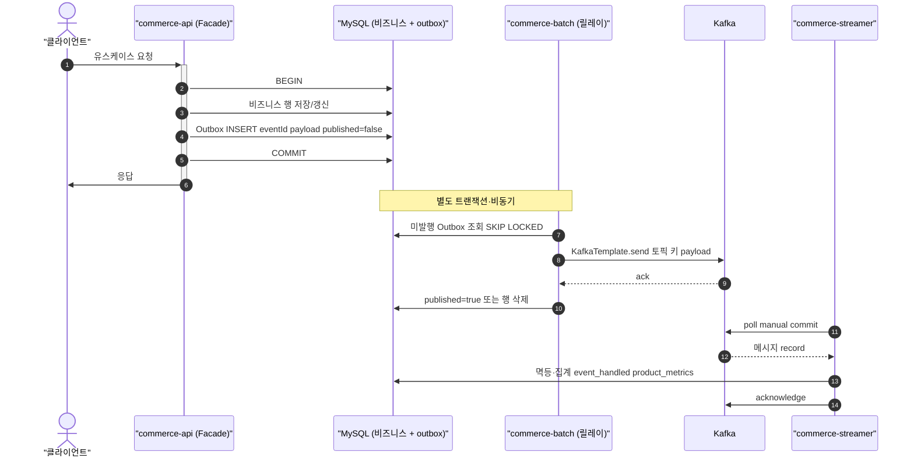
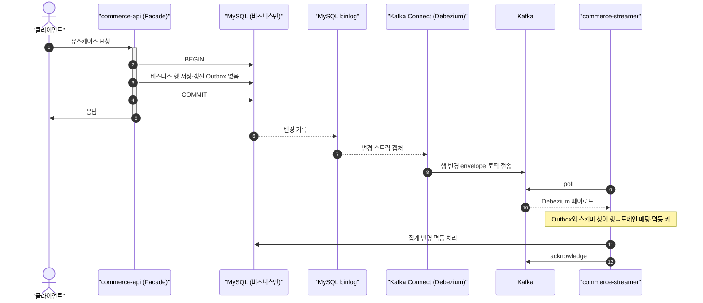

# Kafka 적용 가이드 (loop-pack-be-l2-vol3-java)

이 문서는 `skills/kafka/SKILL.md`(리뷰 관점)를 **본 프로젝트에 어떻게 구현·적용할지** 정리한 것이다.  
`SKILL.md`가 다루는 **Producer → (Outbox) → Consumer → DLQ** 파이프라인을 기준으로 하며, **Spring 이벤트(내부 전파) + Kafka(외부 전파)** 와 **PR 브랜치 전략(Polling 메인 / CDC 부가)** 을 함께 명시한다.

---

## 전체 구현 로드맵 (단계·내용·산출물·PR)

이 절은 **프로젝트 전체를 어떤 순서로 구현할지** 한눈에 정리한다. 세부 설계·도메인 규칙·다이어그램은 **§0~§8** 및 `skills/kafka/SKILL.md`를 따른다.

### 단계 요약표

| 단계    | 이름                     | 목표                          | 산출물(핵심)                                                                                                                                                                      | 권장 PR                                   |
| ----- | ---------------------- | --------------------------- | ---------------------------------------------------------------------------------------------------------------------------------------------------------------------------- | --------------------------------------- |
| **0** | 준비                     | 의존성·로컬 Kafka·토픽             | `commerce-api`(또는 릴레이 앱)에 `modules:kafka` 의존, 로컬 compose, 토픽 생성 스크립트·문서                                                                                                      | `feat/week7-kafka-applicationevent`     |
| **1** | 경계 분리                  | 주요/부가·커밋 후 부가               | `ApplicationEvent`, `@TransactionalEventListener(AFTER_COMMIT)`, Facade·도메인과의 정렬(§0.1)                                                                                       | `feat/week7-kafka-applicationevent`     |
| **2** | Kafka 이벤트 파이프라인 (§0.2) | 시스템 간 전파 + At Least Once 발행 | `commerce-api` 동일 TX Outbox → `commerce-batch` 릴레이 → Kafka → `commerce-streamer`(collector)에서 `product_metrics` upsert·`event_handled`·수동 ack (`SKILL.md` 1·2·3·4·9절) | `feature/kafka-outbox-polling` (메인) |
| **3** | Consumer 고도화·추가 도메인    | DLQ·모니터링·추가 토픽              | DLQ·lag 게이지·DLQ 카운터·Prometheus 알림·Runbook·dev에서 redrive 활성화                                                                                                              | **완료** — 알림 채널(Slack 등) 연결은 인프라 후속                        |
| **4** | 선착순·비동기 쿠폰                 | Kafka 실전 시나리오               | `coupon-issue-requests`, `modules/coupon`, API 발급 요청·상태, streamer 수집기(`SKILL.md` §8, §0.3)                                                                                                                           | **완료** (브랜치·PR별로 세부 상이)     |
| **5** | CDC (학습)               | binlog 기반 전파                | 경로 A(Connect+Debezium) 또는 경로 B(Spring+binlog), **Polling과 토픽 분리**(§5)                                                                                                        | **미착수** — `feature/kafka-cdc` 등 별도 PR            |

### 실행 현황 요약 (이 레포 기준)

| 구간 | 상태 | 한 줄 |
| --- | --- | --- |
| **0~2** Outbox → 릴레이 → streamer 집계 | 완료 | `DomainKafkaTopics`, `commerce-batch` 릴레이, `product_metrics`·`event_handled`·수동 ack |
| **3** DLQ·관측 | 부분 | DLQ 전송·redrive·메트릭은 있음. lag 알람·운영 Runbook은 후속 |
| **4** 쿠폰 비동기 발급 | 완료 | `supports:error`·`modules/coupon` 분리, `coupon-issue-requests`, streamer `CouponIssueRequestCollectorListener` |
| **5** CDC | 미착수 | §5 참고, Polling과 토픽·환경 분리 전제 |

> **변경사항 반영**: 위 표는 `§8` 상세와 동일 시점을 기준으로 한다. 코드 이동만 하고 문서를 안 고친 경우 §8의 “근거 경로”를 우선한다.

### 단계별 상세

#### 0단계 — 준비

- **내용**: `settings.gradle.kts`에 정의된 `modules:kafka`를 **발행·릴레이를 둘 앱**에 연결; 로컬 Kafka 기동(팀 표준: Docker Compose 등); §0.4 토픽 예시에 맞춰 토픽 생성.
- **산출물**: `docker/` 또는 로컬 실행 절차, 테스트용 `spring.kafka.bootstrap-servers`(Testcontainers는 `modules/kafka`에 이미 존재).
- **완료 기준**: 테스트 또는 수동으로 `KafkaTemplate` 전송 → Consumer 수신이 가능.

**본 레포 적용 (commerce-api, 0단계)**

- `apps/commerce-api/build.gradle.kts`: `implementation(project(":modules:kafka"))`.
- `apps/commerce-api/src/main/resources/application.yml`: `config.import`에 `kafka.yml` 추가 (`modules/kafka`의 공통 설정).
- `docker/infra-compose.yml`: Kafka·Kafka UI는 기존 정의 유지 — 로컬 기동은 `docker compose -f docker/infra-compose.yml up -d kafka` (또는 전체 스택).
- `docker/kafka-topics-create.sh`: `product-events`, `order-events`, `coupon-issue-requests` 토픽 생성(컨테이너 `kafka`에 `docker exec`로 실행). 호스트에 Kafka CLI 없이 동작.
- `apps/commerce-api/src/main/resources/application-test.yml`: `spring.profiles.active=test` 시 `KafkaAdmin`이 `kafka:9092`로만 붙지 않도록 `spring.kafka.admin.properties.bootstrap.servers`를 `spring.kafka.bootstrap-servers`와 맞춤(CI·로컬 테스트에서 브로커 없이 컨텍스트 기동 시 불필요한 호스트 불일치 완화).
- **수동 검증**: 인프라 기동 후 `./docker/kafka-topics-create.sh` → `**kafka-console-consumer`** 또는 (로드맵 **2단계** 완료 시) `**commerce-streamer`의 collector 패키지**로 수신·집계 확인. `KafkaTemplate` 송수신 스모크는 2단계 Outbox·릴레이와 함께 추가해도 됨.

#### 1단계 — 경계 분리 (`ApplicationEvent`)

- **내용**: §0.1·§0.1.1 — 주요 로직은 Facade+도메인 단일 트랜잭션; 부가는 `AFTER_COMMIT` 리스너. `LikeFacade`의 `TransactionSynchronization` 계열을 이벤트로 통일할 수 있음.
- **산출물**: 과거형 사실 이벤트 클래스, 리스너(로깅·메트릭·캐시 무효화 등). **Kafka 직접 send 없음.**
- **완료 기준**: 롤백 시 부가 리스너가 비즈니스 성공을 가정하지 않음.

#### 2단계 — Kafka 이벤트 파이프라인 (`commerce-api` → Kafka → `commerce-streamer`) — §0.2

- **내용**: Step 1에서 걸른 이벤트 중 **시스템 간 전파**가 필요한 것만 Kafka로. **At Least Once** 발행은 Transactional Outbox로 보장. 발행 측은 §4·`SKILL.md` 1·2절, 소비 측은 `SKILL.md` 3·4·9절과 §0.2·§0.5.
- **산출물 (한 묶음)**  
  - **Producer 경로**: `*_outbox`·엔티티, **동일 TX** INSERT(또는 Step 1 리스너가 AFTER_COMMIT에서 Outbox만 적재 — **비즈니스와 같은 커밋이 자연스러우면 Facade/도메인 서비스 TX에서 직접 INSERT 권장**), 릴레이(`commerce-batch` 권장, §4.4), `modules/kafka` Producer(`acks=all`, `enable.idempotence=true`).  
  - **Consumer 경로**: `**commerce-streamer`(collector 패키지)** — `@KafkaListener`, `product_metrics` **upsert**, `event_handled(event_id)` 멱등, `enable.auto.commit=false`·처리 성공 후 **manual `acknowledge()`**, 순서 역전 시 페이로드 `version` 또는 `occurredAt`/`updated_at` 낙관적 비교.
- **완료 기준**: E2E로 Outbox → Kafka → 집계 반영까지 검증; `SKILL.md` 1·2·3·4·9절 체크리스트 통과.

#### 3단계 — Consumer 고도화 (DLQ·추가 토픽·운영)

- **내용**: §0.5 — 실패 메시지 격리(DLQ), 재처리, 모니터링; `commerce-streamer` 등 **추가 Consumer** 또는 선착순 쿠폰(§0.3) 등 별도 유스케이스.
- **산출물**: DLQ 토픽/핸들러, 알림·대시보드(선택).
- **완료 기준**: Poison pill·재시도 한도·운영 Runbook이 문서/코드와 일치.

#### 4단계 — 선착순 쿠폰

- **내용**: §0.3 — API는 최소 TX + Outbox 또는 요청 기록; Consumer에서 실제 발급·수량 차감·동시성.
- **산출물**: `coupon-issue-requests` 등 전용 토픽, Consumer 비즈니스 로직.
- **완료 기준**: `SKILL.md` §8 검토 항목 충족.

#### 5단계 — CDC (부가·학습)

- **내용**: §5 — 경로 A 또는 B **하나**; Polling과 **동일 토픽·동일 테이블 이중 발행 방지**(토픽·환경 분리).
- **산출물**: Connect 설정 또는 경로 B 앱, 전용 토픽, Consumer 분기·멱등 키 설계.
- **완료 기준**: 운영·학습 목적이 문서에 명시되고, Polling 경로와 충돌하지 않음.

### PR 순서 권장

1. **메인**: 단계 **0 → 1 → 2**까지 **Outbox + 릴레이 + `commerce-streamer` 집계·멱등**(§0.2)을 **Polling 중심**으로 한 PR 또는 논리적 분할 PR을 먼저 머지한다. (단계 **3**은 DLQ·추가 Consumer 등 **후속**.)
2. 필요 시 **4** (선착순 쿠폰), **5 (CDC)** 는 **별도 PR**, 학습·인프라 비교 목적을 PR 설명에 명시한다.

### §0과의 대응

| 본 절 단계 | §0·기타 절                                                     |
| ------ | ----------------------------------------------------------- |
| 1      | §0.1 Step 1                                                 |
| 2      | §0.2 Step 2, §2~§4 (`commerce-api`·릴레이·`commerce-streamer`) |
| 3      | DLQ·추가 Consumer — §0.5·§3 보강                                |
| 4      | §0.3 선착순 쿠폰                                                 |
| 5      | §5 CDC                                                      |

---

아래 **§0**은 학습용 서브 로드맵 **§0.1(경계 분리) → §0.2(Kafka 파이프라인·`commerce-streamer`) → §0.3(선착순 쿠폰)** 과 토픽·Producer/Consumer 처리 방침, **이벤트 핸들링 테이블과 로그 테이블 분리** 이유를 담는다. 상단 **「전체 구현 로드맵」** 의 번호(1·2·3·4…)와 혼동하지 말 것 — **§0.2 = 로드맵 2단계**(Outbox·릴레이·집계 Consumer 한 묶음), **§0.3 = 로드맵 4단계**(선착순 쿠폰)에 대응한다(대응표는 본 절 하단 참고).

---

## 0. 로드맵: ApplicationEvent 경계 → Kafka 파이프라인 → 선착순 쿠폰

### 0.1 Step 1 — `ApplicationEvent`로 경계 나누기

**목표**: “무조건 이벤트 분리”가 아니라, **주요 로직과 부가 로직의 경계**를 스스로 판단하는 것이 학습 포인트다.

| 구분        | 판단 힌트                                                                                       |
| --------- | ------------------------------------------------------------------------------------------- |
| **주요 로직** | 비즈니스 불변식·일관성·동기적 실패가 치명적인 흐름 (예: 주문 생성, 재고 검증, 결제 확정). Facade의 **단일 트랜잭션** 안에서 도메인 서비스로 완료. |
| **부가 로직** | 커밋 성공 후에만 의미 있거나, 실패해도 **핵심 일관성을 깨지 않는** 작업 (유저 행동 로깅, 알림, 내부 메트릭, **Outbox 행 적재** 등).      |

**주문–결제 플로우**: 주문/결제의 성공·실패와 **같은 트랜잭션에 묶일 필요가 없는** 부가 작업은 `@TransactionalEventListener`로 분리한다.

**좋아요–집계 플로우**: 집계(카운트)는 **eventual consistency**를 허용하는 전형적 후보다. 도메인에서 “좋아요 토글 성공”까지만 동기적으로 보장하고, **전역 집계 반영**은 **§0.2 / 로드맵 2단계**의 Kafka·`**commerce-streamer`**(`product_metrics` 등)에서 맞춘다.

**리스너 phase 선택 (트랜잭션 결과와의 상관관계)**:

| Phase                  | 용도                                                                               |
| ---------------------- | -------------------------------------------------------------------------------- |
| `AFTER_COMMIT` (기본 권장) | 커밋이 확정된 사실만 외부에 반영할 때. Outbox INSERT와 함께 쓸 때도 **비즈니스 행과 같은 커밋**이 먼저 보장된 뒤 후속 처리. |
| `AFTER_ROLLBACK`       | 롤백 시 보정·감사 로깅 등 **실패 전용** 부가 처리.                                                 |
| `BEFORE_COMMIT`        | 같은 트랜잭션 안에서 반드시 실행되어야 하는 훅이 필요할 때만 (부가 로직에는 과용하지 않음).                            |

**Kafka로 보낼지 여부는 Step 1과 별개로 한 번 더 걸른다**: “**시스템 간 전파**(다른 프로세스·다른 바운디드 컨텍스트)가 필요한가?” 에 Yes만 **Outbox에 적재** → 릴레이가 Kafka로 발행.

#### 0.1.1 본 프로젝트에 맞춘 적용 (`apps/commerce-api`)

**레이어와 트랜잭션 경계** (`AGENTS.md`와 동일):

- **주요 로직**: `domain/{도메인}` 의 `*Service` / 엔티티·VO. 불변식·정책 분기는 여기서 끝낸다.
- **유스케이스 조율·트랜잭션 경계**: `application/{도메인}` 의 `*Facade`. `@Transactional` 은 **Facade(또는 진입점 한 곳)** 에 두고, **한 유스케이스당 하나의 커밋 단위**를 유지한다.
- **부가 로직 후보**: Facade/도메인 트랜잭션 **밖** 또는 **커밋 확정 후** — `ApplicationEvent` + `@TransactionalEventListener` 로 옮긴다. (기존 코드와의 정렬은 아래 “이미 있는 패턴” 참고.)

**도메인별로 무엇이 주요 / 부가인지 (이 레포 기준 예시)**

| 영역                    | 주요 로직 (동일 TX 안, 이벤트로 빼지 않음)                                                                                                                | 부가 로직 후보 (커밋 후·비동기 OK)                                                                              |
| --------------------- | ------------------------------------------------------------------------------------------------------------------------------------------ | --------------------------------------------------------------------------------------------------- |
| **주문** `OrderFacade`  | `placeOrder`: `ProductService` 재고 락·검증·차감, `CouponService.validateAndUse`, `OrderService.create` — **전부 주요**. `cancel` 의 주문 상태·도메인 규칙도 주요. | 주문 확정 **사실** 알림, 유저 행동 로그, “주문 생성됨” **Outbox/Kafka용 페이로드 적재**, 운영 메트릭.                              |
| **좋아요** `LikeFacade`  | `LikeService.addLike` / `removeLike` — 사용자–상품 관계 **영속 반영**까지 주요.                                                                           | 전역 집계(`product_metrics`), 타 시스템 전파, **상세 설명은 §0.2**. PDP/리스트 **Redis 캐시 무효화**는 커밋 후 실행이 맞음 (아래 참고). |
| **쿠폰** `CouponFacade` | 템플릿·발급·조회 등 **도메인 규칙을 바꾸는** 처리. 주문 안에서의 쿠폰 사용은 `OrderFacade` TX에 포함.                                                                       | 선착순 발급을 Kafka로만 넘기는 경우 **§0.3** — API TX는 “요청 기록” 수준만.                                              |
| **상품·브랜드·장바구니·유저**    | 각 `*Facade` 에서 조율되는 **저장·검증·조회 규칙**이 주요.                                                                                                   | 감사 로그, 추천/분석용 이벤트, Outbox.                                                                          |

**리스너 phase — 이 프로젝트에서의 선택 규칙**

| 사용할 phase                      | 언제 (본 레포)                                                                                                    |
| ------------------------------ | ------------------------------------------------------------------------------------------------------------ |
| `**AFTER_COMMIT`** (기본)        | 알림, 행동 로그, **Outbox INSERT가 별도 리스너로만 갈 때**, 캐시 무효화를 `ApplicationEvent` 로 바꿀 때. **롤백된 주문 시도는 기록되면 안 될 때** 필수. |
| `**AFTER_ROLLBACK`**           | “주문 실패” 같은 **실패 전용** 메트릭/알림만 필요할 때. 과다 사용 금지 — 대부분은 주요 플로우의 예외 처리·로그로 충분.                                    |
| `**BEFORE_COMMIT`**            | 부가 로직에는 **권장하지 않음**. 정말로 “같은 트랜잭션에 추가 INSERT가 반드시 함께 커밋”되어야 하면 Facade/서비스 메서드 안에서 명시 호출이 낫다.                 |
| `**@EventListener` (트랜잭션 무관)** | 트랜잭션과 무관하게 항상 실행돼야 할 때만. **DB 커밋과 맞춰야 하는 부가 작업에는 부적합.**                                                      |

**이미 있는 코드와의 정렬**

- `LikeFacade` 는 `TransactionSynchronization.afterCommit` 으로 **캐시 무효화**를 커밋 이후에 실행하고 있다. Step 1 에서는 동일한 의미를 `**@TransactionalEventListener(phase = AFTER_COMMIT)`** 로 옮기면 “부가 로직 = 커밋 후” 가 **이벤트 한 가지 패턴**으로 통일된다 (동작은 동일 계열).
- **Kafka 직접 send** 는 리스너/Facade 어디에서도 **하지 않고**, **Outbox + 릴레이**로만 외부 발행한다 (`§2`, `SKILL.md` 1·2절).

**이벤트 클래스 배치 (제안)**

- `application` 또는 `domain` 에 `OrderPlacedEvent`, `LikeChangedEvent` 등 **과거형 사실** 이름을 쓰고, Facade 메서드 끝에서 `ApplicationEventPublisher.publishEvent(...)` 호출은 **선택** — “발행은 주요 로직 성공 직후, 처리는 커밋 후”가 되도록 하려면 **도메인 서비스/Facade에서 publish + 리스너는 AFTER_COMMIT** 조합이 일반적이다. (publish 시점이 트랜잭션 안이어도, 리스너 실행은 phase 에 따라 커밋 후로 미뤄진다.)

---

### 0.2 Step 2 — Kafka 이벤트 파이프라인 (`commerce-api` → Kafka → `commerce-streamer`)

**목표**: Step 1에서 분리한 이벤트 중 **시스템 간 전파가 필요한 것**만 Kafka로 내보내고, **At Least Once** 발행을 **Transactional Outbox**로 보장한다.

**구조 (요약)**:

| 단계  | 담당                               | 내용                                                                                                                                                                                                        |
| --- | -------------------------------- | --------------------------------------------------------------------------------------------------------------------------------------------------------------------------------------------------------- |
| 1   | `commerce-api`                   | 비즈니스 트랜잭션과 **동일 TX**에 **Outbox INSERT**. (대안: Step 1의 `@TransactionalEventListener(AFTER_COMMIT)`에서 **Outbox 행만** 적재 — 다만 비즈니스 변경과 **같은 커밋**이 자연스러우면 **Facade/도메인 서비스 TX 안에서 직접 INSERT**하는 편이 정합 맞추기 쉽다.) |
| 2   | 릴레이(스케줄/워커, 예: `commerce-batch`) | 미발행 Outbox → `KafkaTemplate.send` — Producer는 `**acks=all`**, `**enable.idempotence=true`** (`SKILL.md` 1절).                                                                                              |
| 3   | `commerce-streamer` (Consumer 앱) | 수신 후 `**product_metrics**`(좋아요 수·판매량·조회 수 등)에 **upsert**.                                                                                                                                                 |

**Consumer 반드시 처리** (`SKILL.md` 3·4·9절과 정합):

- `**enable.auto.commit=false`**, 비즈니스·DB 반영 **성공 후** **manual `acknowledge()`** (9절: 오프셋 커밋 = 처리 완료 이후).
- `**event_handled(event_id PK)**` (또는 동등 테이블)로 **멱등**: 이미 처리한 `event_id`는 스킵 (4절).
- **동일 파티션 키·상품 등에 대한 순서 역전** 대비: 페이로드 `**version`** 또는 `**occurredAt` / `updated_at`** 으로 **최신 이벤트만** 집계 상태에 반영(낙관적 비교) (4절).
- 멱등 기록과 감사 로그의 역할 분리는 §0.5 참고.

---

### 0.3 Step 3 — Kafka 기반 선착순 쿠폰 발급

**목표**: Step 2에서 익힌 Kafka를 **실전 시나리오**에 적용한다.

- **API**: 발급 요청을 **Kafka에 발행만** (실제 발급·수량 차감은 API TX에 넣지 않거나 최소화).
- **Consumer**: 실제 쿠폰 발급, **발급 수량 상한**(예: 선착순 100명)에 대한 **동시성 제어** (DB 락/낙관적 락/Redis INCR 게이트 등 — `SKILL.md` 8절).
- **멱등성**: 사용자·쿠폰 단위 중복 발급 방지 + `event_id`/`event_handled` 처리.

---

### 0.4 토픽 설계 (예시)

| 토픽                      | 용도                                | 파티션 키                       |
| ----------------------- | --------------------------------- | --------------------------- |
| `product-events`        | **상품(product)** 도메인 이벤트(좋아요·집계 등) | `productId`                 |
| `order-events`          | 주문/결제 이벤트                         | `orderId`                   |
| `coupon-issue-requests` | 쿠폰 발급 **요청**(Command 성격)          | `couponId` (또는 요청 단위 유니크 키) |

같은 애그리게이트의 순서가 필요하면 **키를 고정**한다 (`SKILL.md` 5절).

---

### 0.5 이벤트 핸들링 테이블 vs 로그 테이블 — 왜 분리하는가

이 프로젝트에서 말하는 **두 가지**는 역할이 다르다.

|           | `**event_handled` (또는 처리 이력)**                                   | **감사·도메인 로그 / append-only 로그**                  |
| --------- | ---------------------------------------------------------------- | ----------------------------------------------- |
| **목적**    | “이 **메시지(event_id)** 를 이미 **비즈니스 반영**했는가?” — **멱등·중복 제거**의 운영 기준 | “이 **사건**이 실제로 어떻게 일어났는가?” — **추적·감사·재현·분쟁 대응** |
| **쓰기 패턴** | PK=`event_id`로 **insert 또는 upsert**, 재처리 시 **스킵** 판단에 사용         | **append-only**; “처리했음”을 삭제로 대체하지 않음            |
| **보존**    | At Least Once 환경에서 **짧게 유지하거나**, 정규화 후 **아카이브** 가능               | 정책에 따라 **장기 보관**, 컴플라이언스 요구 반영                  |
| **삭제·정리** | **처리 완료** 후 오래된 행 삭제해도 **집계 상태**는 `product_metrics` 등에 이미 반영됨    | 감사 로그를 임의 삭제하면 **추적 불가**                        |

**한 테이블에 합치면 생기는 문제**:

- 멱등용 행을 지우거나 덮어쓰는 순간 **감사 추적**이 끊긴다.
- “처리 여부”와 “무슨 일이 있었는지”를 **같은 PK/같은 수명**으로 묶으면, 운영(중복 정리)과 **법적 보관** 요구가 충돌한다.
- 쿼리 패턴도 다르다: 멱등은 **event_id 단건 lookup**, 로그는 **기간·사용자·주문별 스캔**.

**권장**: Consumer는 `**event_handled`로 멱등 처리**하고, 필요 시 **도메인 이벤트 로그**(또는 감사 테이블)는 **별도 append**로 남긴다. 둘 다 남기면 “이번 메시지는 이미 적용했다”와 “당시 페이로드·결과는 이랬다”를 **동시에** 만족한다.

---

## 1. 현재 레포 상태 (기준점)

| 구분       | 내용                                                                                                                                          |
| -------- | ------------------------------------------------------------------------------------------------------------------------------------------- |
| Kafka 모듈 | `modules/kafka`: `KafkaTemplate`, `ProducerFactory`/`ConsumerFactory`, 배치 리스너용 `ConcurrentKafkaListenerContainerFactory` (`AckMode.MANUAL`) |
| API 앱    | `apps/commerce-api`: `modules:kafka` 의존, 동일 TX **Outbox INSERT** (`TransactionalOutboxWriter` 등) — Kafka 직접 send는 트랜잭션 안에서 하지 않음            |
| 릴레이      | `apps/commerce-batch`: Outbox 폴링 → Kafka, 발행 마킹/정리 등 (`§4`)                                                                                 |
| Consumer | Step 2 목표 Consumer는 `**commerce-streamer`** (`product_metrics`, `event_handled`, manual ack).                                               |
| 리뷰 체크리스트 | 상세 항목은 `**skills/kafka/SKILL.md`** 참고                                                                                                       |

---

## 2. Spring 이벤트(내부)와 Kafka(외부)의 역할

### 2.1 내부: `ApplicationEvent`

- **목적**: 단일 JVM 안에서 “**DB 커밋 이후**” 부가 작업을 분리 (로깅, 메트릭 등). **Outbox INSERT**는 Step 1 리스너로만 적재할 수도 있으나, 비즈니스와 **같은 커밋**이 자연스러우면 **도메인/Facade TX에서 직접 적재**하는 편이 권장된다(§0.2·로드맵 2단계).
- **권장**: `@TransactionalEventListener(phase = AFTER_COMMIT)` — 커밋 성공 후에만 실행.
- **주의**: 리스너에서 `**KafkaTemplate.send()` 직접 호출**하면 DB 커밋과 Kafka 발행의 **원자성이 깨질 수 있음** (`SKILL.md` 1·2절).  
  - Kafka로 나가는 메시지는 **Transactional Outbox + 릴레이** 또는 **CDC 소비 경로**로 일관되게 다룬다.

### 2.2 외부: Kafka

- **목적**: `commerce-streamer`(집계·수집 Consumer), 타 서비스와 **비동기 연동** (§0.2 참고).
- **발행 경로 (이 프로젝트에서의 두 갈래)**  
  - **Polling (메인 PR)**: Outbox 테이블에 기록 → 스케줄/릴레이가 읽어 Kafka로 전송.  
  - **CDC (부가·학습 PR)**: DB 변경이 binlog 등을 통해 토픽으로 흘러감 (Connect/Debezium 등). Spring Producer는 최소화 가능.

### 2.3 Polling vs CDC — 시퀀스 다이어그램

아래는 **같은 비즈니스 사건**이 Kafka까지 가는 경로가 어떻게 다른지 보여 준다. **Polling**은 애플리케이션이 **Outbox에 도메인 이벤트**를 남기고 릴레이가 전송한다. **CDC**는 애플리케이션은 **일반 테이블만** 갱신하고, **binlog → Connect**가 토픽을 채운다. 두 경로를 **동시에 같은 토픽**에 켜면 이중 발행이 되므로 환경·토픽으로 격리한다 (`§5.1`).

#### Polling (Transactional Outbox + 릴레이)

#### CDC (Debezium / Kafka Connect)

**요약**: Polling은 **“보낼 편지(Outbox)”를 앱이 명시적으로 쓴 뒤 릴레이가 Kafka에 넣는다**. CDC는 **“테이블이 바뀐 사실”이 binlog를 통해 Connect가 Kafka에 넣는다**. Consumer는 둘 다 **최소 한 번 전달**을 가정하지만, **메시지 형태**가 달라서 CDC 쪽은 **매핑·멱등 전략**을 별도로 맞춘다.

---

## 3. SKILL.md ↔ 구현 위치 매핑

| SKILL.md 절                                      | 프로젝트 내 제안 위치                                                                                                                                                                                    |
| ----------------------------------------------- | ----------------------------------------------------------------------------------------------------------------------------------------------------------------------------------------------- |
| 1. Producer 설정 (`acks`, `enable.idempotence` 등) | `modules/kafka`의 `ProducerFactory` 빌드 시 `KafkaProperties`와 병합                                                                                                                                   |
| 2. Transactional Outbox                         | `commerce-api` JPA 트랜잭션과 동일 TX: `*_outbox` 테이블 + 엔티티/리포지토리 (`modules/jpa` 패턴과 정합)                                                                                                               |
| 2. 릴레이 (Outbox → Kafka)                         | **로드맵 2단계·§0.2**: `**commerce-batch`**(권장) 등에서 `@Scheduled` 또는 전용 릴레이가 `published=false` 행만 배치 처리 — `SKILL.md` 1절 Producer 설정                                                                   |
| 3·4·9. Consumer·멱등·오프셋                          | **로드맵 2단계·§0.2**: `**commerce-streamer`** — `product_metrics` upsert, `event_handled(event_id)`, `enable.auto.commit=false`, 처리 성공 후 manual `acknowledge()`, 순서 역전 시 `version`/`occurredAt` 비교. |
| 5. Partition Key                                | 동일 애그리게이트 순서가 필요하면 `orderId` / `productId` 등 **고정 키** 문자열 사용                                                                                                                                    |
| 6. DLQ                                          | 재시도 한도 후 `.DLQ` 토픽 또는 격리 저장 + 모니터링                                                                                                                                                              |
| 7. 이벤트 설계                                       | `eventId`, `eventType`, `occurredAt`, 페이로드 분리 (Command/Event 혼동 방지)                                                                                                                             |

CDC는 SKILL에 전용 절은 없으나, **중복 전달·순서(파티션 내)** 가 기본 가정이므로 **Consumer 멱등(4절)** 을 더 엄격히 적용한다.

---

## 4. Polling PR (메인 브랜치) — DB 부하·구현 단순함 우선

**의도**: 비즈니스 DB에 **Outbox**를 두고, **제한 건수·배치**로 읽어 Kafka에 발행한다. CDC 인프라 없이 **발행량·폴링 주기**로 부하를 조절하기 쉽다.

### 4.1 흐름

1. **트랜잭션**: Facade/도메인 저장과 `Outbox` INSERT를 **동일 `@Transactional`** 에서 수행(§0.2 — AFTER_COMMIT 전용 Outbox는 대안).
2. **릴레이**: `published = false` (또는 동등 필드) 행을 `id` 순 등으로 조회 — 가능하면 `**FOR UPDATE SKIP LOCKED`** 등으로 동시성 제어. **본 레포 권장 위치: `commerce-batch`**(§4.4).
3. **전송 성공 시**: 행 삭제 또는 `published = true` 로 마킹.
4. **Consumer**: **§0.2·로드맵 2단계**와 동일하게 `**commerce-streamer`** 에서 `product_metrics` upsert·`event_handled`·**수동 ack**·순서 역전 대비. **DLQ·재처리 고도화**는 로드맵 **3단계**에서 보강.

### 4.2 SKILL.md와의 정합

- **2절**: 비즈니스 데이터와 Outbox가 **같은 DB 트랜잭션**.  
- **1절**: Producer는 트랜잭션 **밖**(릴레이)에서 `KafkaTemplate` 사용 — DB와 Kafka의 “가짜 원자성” 문제를 Outbox로 회피. 동기 `get()` 사용 시 `**send-ack-timeout`** 으로 스레드 고갈을 방지(§4.5).  
- **3·4·9절**: Consumer는 `enable.auto.commit=false`, 멱등(`event_handled`), 처리 완료 **후** 오프셋 커밋(manual ack) — §0.2 표와 동일.

### 4.3 모듈 의존성

- `commerce-api`: Outbox·공통 설정을 위해 `implementation(project(":modules:kafka"))` 를 둔다(릴레이를 API 프로세스 안에 둘 때도 동일).  
- 릴레이를 `**commerce-batch`** 에만 두면 API 쪽은 **DB·Outbox INSERT** 위주로 유지한다(§4.4).

### 4.4 릴레이 위치: API 내 `@Scheduled` vs batch 전용 앱

| 구분          | **API(`commerce-api`) 안에 스케줄**                              | **batch 전용(`commerce-batch` 등)**                                                      |
| ----------- | ----------------------------------------------------------- | ------------------------------------------------------------------------------------- |
| **배포·운영**   | 프로세스 하나로 HTTP + 발행 처리. 단순.                                  | 앱 두 개(또는 워커 하나) — 모니터링·배포 포인트 증가.                                                     |
| **부하**      | 트래픽과 폴링·Kafka send가 **같은 JVM** — 피크 시 서로 간섭 가능.             | HTTP와 **분리** — CPU/커넥션 한도를 다르게 줄 수 있음.                                                |
| **다중 인스턴스** | API를 N개 띄우면 스케줄도 N번 도므로 `**SKIP LOCKED` / 리더 선출** 등 **필수**. | 릴레이 인스턴스를 **1개(또는 소수)** 로 고정하기 쉬움 — 중복 발행 제어가 단순해지는 경우가 많음.                           |
| **장애 범위**   | API 재시작 시 릴레이도 함께 중단.                                       | API 장애와 **독립** (반대로 릴레이만 죽어도 API는 살아 있음).                                             |
| **코드 위치**   | Outbox 조회·Kafka가 API 모듈에 모임 — 이후 분리 시 리팩터 필요.               | Outbox 엔티티/리포지토리는 `**modules/jpa` 등 공유**에 두고, 릴레이만 batch에 두기 좋음(API가 batch에 의존하지 않음). |

#### 본 프로젝트에 맞는 권장

- **구조적 권장(중장기)**: 이 레포에는 이미 `**apps/commerce-batch`** 가 있고, 스케줄·배치 작업을 담기 위한 앱이다. Outbox → Kafka 릴레이는 **HTTP와 성격이 다르므로 `commerce-batch`에 두고**, `commerce-api`는 **동일 DB 트랜잭션에서 Outbox INSERT만** 수행하는 구성을 권장한다.  
  - 전제: Outbox 엔티티·조회 API는 `**modules/jpa`(또는 API·batch가 공통으로 의존하는 모듈)** 에 두어 **batch가 `commerce-api` 애플리케이션 모듈에 의존하지 않게** 한다 (`AGENTS.md`의 레이어·모듈 경계와 맞음).
- **첫 통합·학습 PR에서만 예외적으로**: 파이프라인을 **빨리 한 줄로** 검증하려면 릴레이를 **일시적으로 `commerce-api`의 `@Scheduled`** 로 두어도 된다. 이때도 **릴레이 로직은 클래스로 분리**해 두면 이후 `commerce-batch` 로 **이동만** 하면 된다.  
  - API를 여러 인스턴스로 띄울 계획이면 **처음부터 batch 쪽 릴레이**를 택하거나, API 단일 인스턴스·`SKIP LOCKED` 중 하나를 명시한다.

**요약**: **운영·확장을 염두에 두면 `commerce-batch` + 공유 Outbox** 가 이 프로젝트에 잘 맞고, **스피드 우선이면 API 내 스케줄 → 로직 분리 후 batch 이전**이 안전한 절충이다.

### 4.5 트랜잭션·릴레이·보관 — 트레이드오프와 운영 전제

좋아요·Outbox·`commerce-batch` 릴레이에 대한 **설계 선택**과 **운영 전제**를 한곳에 둔다.

**맥락**

- `LikeService`는 동시성·데드락 회피를 위해 `ensureProductStatsExists`, `doAddLike`에 `**REQUIRES_NEW`** 를 쓴다.
- 릴레이는 전송 확인을 위해 `KafkaTemplate.send(...).get(timeout)` 을 쓴다.
- Outbox는 `published=true` 마킹 후에도 행이 남으므로 **정리 스케줄**이 필요하다.

**Transaction granularity (트랜잭션 경계)**

- `REQUIRES_NEW` 는 **의도된 선택**이다. 상위 트랜잭션(Facade 등)이 롤백되어도 **이미 커밋된 좋아요·Outbox 행은 되돌리지 않는다**.
- 상위와의 단기 불일치는 **최종적 일관성**과, 이후 단계의 **Consumer 멱등** 설계로 맞춘다.
- `**LikeFacade.addLike` 이후 포인트 지급·로그 저장 등이 추가될 때** — **비즈니스 로직 확장 시 원칙**: Facade·유스케이스에서 **같은 커밋에 묶어도 되는 작업은 동일 트랜잭션에 합류**한다.
- **성능·데드락 등으로 트랜잭션 분리를 유지할 경우**: 부분 성공(Partial success)을 허용할지, **보상 트랜잭션·사가** 등을 **명시적으로 검토**한다. (예: 포인트·로그를 같은 Facade 트랜잭션에 넣을 수 있으면 합류; 넣지 못하면 실패 시 보상 여부를 도메인 정책으로 결정.)

**Relay throughput (릴레이 처리량)**

- 현재는 **전송 순서·구현 단순화**를 위해 동기 `get()` 으로 ack 를 확인한다.
- `**get()` 은 무한 대기하지 않는다.** `outbox.relay.send-ack-timeout`(기본 `5s`)으로 **명시적 타임아웃**을 둔다. 타임아웃·실패 시 `**published=false` 유지** → 다음 폴링에서 재시도(배치 스레드 고갈 방지).
- 처리량 병목이 확인되면 **비동기 전송 + 완료 단위 일괄 마킹** 등으로 개선하는 후속 작업으로 다룬다.

**Data retention (Outbox 테이블)**

- Outbox 테이블은 **무한 성장**을 가정할 수 없다.
- `**OutboxCleanupScheduler` 가동은 운영 필수 전제**다. (보관 기간·배치 크기는 환경별 `outbox.cleanup.`* 설정.)
- 대량 적재 시에는 **파티셔닝·아카이브** 등을 별도 검토한다.

**구현 대응 (현재 코드)**

- `OutboxRelayService`: `send().get(timeout)` — 실패·타임아웃 시 미마킹·재시도.

---

## 5. CDC PR (부가·학습 브랜치)

**의도**: **DB 변경 로그(binlog 등)를 읽어** Kafka 토픽으로 흘리는 **로그 기반 CDC**를 다룬다. §4 **Transactional Outbox(폴링)** 와는 **다른 축**이다 — Outbox는 “애플리케이션이 같은 트랜잭션에 적은 발행 큐”, CDC는 “DB 엔진이 남긴 변경 로그”.  
운영·스키마 진화·Polling과의 **이중 발행 방지**는 학습·실험 환경에서 **토픽·설정으로 격리**한다.

### 5.0 용어: 로그 기반 CDC vs Transactional Outbox

|            | **로그 기반 CDC (본 §5)**               | **Transactional Outbox (§4)** |
| ---------- | ---------------------------------- | ----------------------------- |
| **읽는 위치**  | MySQL **binlog** (또는 PG WAL 등)     | 애플리케이션이 쓰는 **Outbox 테이블**     |
| **잡히는 변경** | DB에 커밋된 변경 **전반** (다른 클라이언트·배치 포함) | **우리 앱이 Outbox에 남긴 사건**만      |
| **메시지 형태** | 보통 **행 단위** envelope               | **도메인 이벤트** JSON 등 (우리가 정의)   |

“스프링으로만 구현”은 **Spring Framework에 binlog API가 있는 것이 아니라**, 아래 **경로 B**처럼 **Spring Boot 앱 + binlog 전용 JVM 라이브러리**로 Connect 없이 돌리는 경우를 말한다.

---

### 5.1 두 가지 로그 기반 CDC 구현 축

| 경로        | **A — Kafka Connect + Debezium**                  | **B — Connect/Debezium 미사용**                                               |
| --------- | ------------------------------------------------- | -------------------------------------------------------------------------- |
| **역할 분담** | Connect가 binlog 소비·토픽 라우팅, Debezium이 MySQL 커넥터 제공 | **Spring Boot 앱**(또는 전용 JVM 프로세스)이 binlog 클라이언트로 읽고 `KafkaTemplate` 등으로 전송 |
| **운영 단위** | Connect **클러스터** + 커넥터 설정(JSON)                   | **앱 배포** 한 벌 + (선택) *별도 `apps/` 모듈**                                       |
| **장점**    | 검증된 커넥터, 스키마 토픽·SNAPSHOT 등 **기능 풀세트**, 운영 레퍼런스 많음 | 인프라 의존 최소, **코드로 파이프라인을 한눈에**, 학습·커스터마이즈에 유리                               |
| **단점**    | Connect 운영·버전·권한 학습 부담                            | **binlog position 관리·재시작·장애 복구**를 **직접** 구현해야 함                            |

**본 레포에서의 위치 제안**: 경로 A는 **인프라·커넥터 YAML** 중심, 경로 B는 예를 들어 `**apps/commerce-streamer` 확장** 또는 `**commerce-cdc-reader` 류 신규 앱** + `modules/kafka` 재사용.

---

### 5.2 경로 A — 설계 (Kafka Connect + Debezium)

**구성 개요**

- **Kafka Connect** 클러스터(분산 모드 권장)에 **Debezium MySQL Connector** 플러그인 로드.
- **소스 DB**: 본 프로젝트 MySQL — 커넥터용 **전용 DB 사용자** (REPLICATION 슬롯/binlog 읽기 권한 등 DB 버전에 맞게 부여).
- **토픽**: Debezium 기본 네이밍(`서버명.스키마.테이블`) 또는 **SMT**(Single Message Transform)로 **프로젝트 토픽 규칙**에 맞게 변환 — **Polling PR의 `product-events` 등과 동일 토픽에 쓰지 않는다** (이중 발행 방지).
- **스키마**: **Schema Registry**를 쓸지 여부(운영 규모·팀 표준에 따름). 학습 단계에서는 미사용 + JSON converter로 단순화 가능.
- **Consumer(`commerce-streamer` 등)**: **Debezium envelope**(`before`/`after`/`op`)를 받아 **도메인 집계·멱등 테이블**에 매핑 — §0.2의 `event_handled`와 **키 설계가 다를 수 있음**(예: `(filename, offset)` 또는 Debezium 메시지 id).

**시퀀스**: §2.3의 **CDC 다이어그램**(앱 → MySQL → binlog → Connect → Kafka)과 동일 계열.

---

### 5.3 경로 A — 구현 단계 (권장 순서)

1. **로컬/도커**: Kafka + (선택) Schema Registry + **Kafka Connect** + MySQL — `docker/` 또는 별도 compose로 재현 가능하게 문서화.
2. **MySQL**: `binlog_format`·`binlog_row_image` 등 Debezium 요구사항에 맞게 조정(버전별 체크리스트).
3. **DB 사용자**: replication 권한 있는 계정 생성, 최소 권한 원칙.
4. **커넥터 등록**: connector JSON — DB 접속, 포함 테이블 필터, 토픽 프리픽스, **토픽명이 Polling 경로와 겹치지 않게** 명시.
5. **검증**: 토픽에 `CREATE`/`UPDATE`/`DELETE` 이벤트 유입 확인, **Consumer 스텁**으로 deserialize 확인.
6. **Spring Consumer**: `modules/kafka` 설정으로 **전용 토픽** 구독, envelope → `product_metrics` / `event_handled` 매핑, **멱등·순서** 규칙 구현.
7. **모니터링**: Connect REST 상태, lag, DLQ/에러 토픽(팀 표준에 따름).

**브랜치 구현 산출물 (경로 A)**:

- `docker/cdc/connect-compose.yml`
- `docker/cdc/connectors/mysql-loopers-connector.json`
- `docker/cdc/register-connector.sh`
- `docs/cdc/README-connect-debezium.md`

---

### 5.4 경로 B — 설계 (Connect/Debezium 없음, Spring + binlog 클라이언트)

**구성 개요**

- **Spring Boot** 애플리케이션(전용 마이크로서비스 또는 `commerce-streamer`에 모듈 분리)이 **시작 시** binlog 클라이언트를 구동.
- **의존성**: MySQL binlog를 읽는 **공개 JVM 라이브러리**(예: `mysql-binlog-connector-java` 계열 — **버전·라이선스·유지보수**는 도입 시점에 선택). Spring 자체는 **DI·설정·수명주기·트랜잭션 경계(커서 저장)** 만 담당.
- **커서 저장**: 마지막으로 처리한 **binlog 파일명 + position** (또는 GTID)를 **DB 테이블** 또는 **소수 인스턴스 전용** 저장소에 기록 — 재시작 시 **중복 발행·건너뜀** 방지.
- **Kafka 전송**: `modules/kafka`의 `KafkaTemplate` + **경로 A와 동일하게 Polling과 다른 토픽** (예: `product-events-cdc-app`).
- **멀티 인스턴스**: binlog는 **단일 리더**만 읽어야 하므로 **앱 인스턴스 1개** 또는 **리더 선출·파티셔닝**을 설계에 명시(미구현 시 단일 인스턴스로 문서화).

**시퀀스**: §2.3 CDC 다이어그램에서 **Kafka Connect 블록을 “Spring CDC Reader 컴포넌트”로 치환**한 그림으로 이해하면 된다.

---

### 5.5 경로 B — 구현 단계 (권장 순서)

1. **모듈/앱**: `modules/kafka` 의존 + binlog 라이브러리 의존성 추가 — **새 앱**이면 `settings.gradle.kts`에 서브프로젝트 등록.
2. **설정**: DB 접속(host, port, **replication 계정**), 시작 커서(최초: 최신 binlog 또는 스냅샷 정책을 문서로 고정).
3. **커서 테이블**: JPA 엔티티·마이그레이션 — `file` + `position` (및 선택 GTID), **업데이트는 처리 성공 후** (Connect의 offset 저장과 동일 역할).
4. **Binlog 리스너**: `@Component`에서 클라이언트 구독, 이벤트 루프는 **별도 스레드** 또는 라이브러리 권장 패턴 — **애플리케이션 종료 시** 우아한 disconnect·커서 flush.
5. **변환 레이어**: RowChange → **내부 DTO** → Kafka record — **파티션 키**(예: PK `productId`)는 §0.4와 정합.
6. **Producer**: `acks=all`, `enable.idempotence` — `SKILL.md` 1절과 동일.
7. **Consumer**: 경로 A와 **동일 Consumer 코드**를 쓸 수 있음 — **토픽만** 경로 B 전용으로 구독.
8. **장애 시나리오**: DB 장애·Kafka 장애·앱 크래시 시 **재처리·중복**을 전제로 **Consumer 멱등**을 반드시 검증.

---

### 5.6 경로 A vs B — 비교 요약

| 항목             | **경로 A (Connect + Debezium)** | **경로 B (Spring + binlog 라이브러리)** |
| -------------- | ----------------------------- | -------------------------------- |
| **신규 인프라**     | Connect 클러스터                  | 거의 없음(앱만)                        |
| **운영 복잡도**     | Connect + 커넥터 버전              | 앱·커서·단일 리더                       |
| **스키마 진화**     | Debezium + (선택) Registry      | **직접** 매핑 또는 단순 JSON             |
| **Spring 코드량** | 적음(Consumer·테스트)              | 많음(리더·커서·전송)                     |
| **학습 포인트**     | 업계 표준 파이프라인                   | binlog·분산 시스템 “직접 구현” 체감         |

---

### 5.7 공통 유의사항 (Polling PR과의 공존)

- 페이로드가 **행 변경(envelope)** 이면 Outbox의 **도메인 이벤트 JSON**과 **다르다**. Consumer는 **정규화·멱등 upsert**로 방어한다.  
- **동일 비즈니스 사건**에 대해 **Outbox 릴레이와 CDC가 같은 토픽**으로 동시에 쏘면 **이중 발행**이다. 학습 시 **토픽 분리** 또는 **한쪽 비활성**을 명시한다.  
- 트랜잭션 안에서 `kafkaTemplate.send()` 하는 안티패턴과는 별개로, **중복·역순** 가능성이 높아 **§4 멱등**, **§0.4 파티션 키**, `SKILL.md` 4·5·9절 검토가 필수다.

---

## 6. PR 전략 요약

| 브랜치              | 역할                                                                                                              | 비고                         |
| ---------------- | --------------------------------------------------------------------------------------------------------------- | -------------------------- |
| **Polling (메인)** | Outbox + 릴레이(`commerce-batch` 권장) + Kafka + `**commerce-streamer`**(집계·멱등·수동 ack) **한 줄기** — 로드맵 **2단계** = §0.2 | §4                         |
| **CDC — 경로 A**   | Connect + Debezium으로 binlog → Kafka                                                                             | 인프라·커넥터 설정 + Consumer 매핑   |
| **CDC — 경로 B**   | Spring 앱 + binlog 라이브러리 → Kafka                                                                                 | Connect 없음, 커서·단일 리더 직접 관리 |

**Spring 코드 비중**: Polling > **CDC 경로 B** > **CDC 경로 A** (일반적으로).

권장 순서: **Polling PR을 먼저** 머지하여 **§0.2·로드맵 2단계** 전체(`commerce-api` → Outbox → `commerce-batch` 릴레이 → Kafka → `commerce-streamer`)를 갖춘 뒤, **로드맵 3단계(DLQ 등)**·**CDC**는 후속으로 실험한다 — **동일 환경에서 A와 B를 동시에 같은 테이블에 붙이면** 중복·정합 문제가 생기므로 **브랜치·토픽·환경을 분리**한다.

---

## 7. 참고 문서

- **본 문서 §「전체 구현 로드맵」·「실행 현황 요약」** — 단계 요약표(0~5), 현재 완료/부분/미착수, PR 순서, §0과의 대응표  
- **§8.3·§8.4·§8.6** — 3단계 완료 요약·Collector 멱등·**의사결정 보류** 항목 · `kafka-step3-runbook.md`  
- `skills/kafka/SKILL.md` — Kafka 코드 리뷰 시 확인할 Producer/Outbox/Consumer/DLQ 체크리스트  
- **§0 (본 문서)** — §0.1~0.3 학습 로드맵(상단 로드맵 **1·2·4단계**와 대응), **§0.2** `commerce-api`→Kafka→`commerce-streamer`, **§0.1.1 본 프로젝트 적용**, 토픽 예시, `event_handled` vs 로그 테이블 분리  
- **§2.3** — Polling(Outbox+릴레이) vs CDC(binlog+Connect) **시퀀스 다이어그램**  
- **§5** — **로그 기반 CDC**: 경로 A(Connect+Debezium) vs 경로 B(Spring+binlog 라이브러리) **설계·구현 단계**, Polling과의 용어 구분(`§5.0`)  
- **§4.4** — API 내 스케줄 vs `commerce-batch` 릴레이 트레이드오프·**본 레포 권장**  
- **§4.5** — `REQUIRES_NEW`·부분 커밋·Facade 확장 시 트랜잭션 합류/보상, 릴레이 `get()`·`send-ack-timeout`, Outbox cleanup 필수  
- `AGENTS.md` — 레이어 경계, 트랜잭션 경계(Facade), 공유 모듈 수정 시 유의사항

---

## 8. 현재 구현 상태 · 남은 단계

`commerce-api` → `commerce-batch` → `commerce-streamer` 흐름과, 이후 반영된 **모듈 분리·쿠폰 파이프라인**을 함께 적는다.

### 8.1 핵심 파이프라인 (완료)

| 항목 | 근거 |
| --- | --- |
| API Outbox 적재 | Facade·도메인 동일 TX에서 `TransactionalOutboxWriter` 등으로 적재 (예: `product-events`, `order-events`, `user-events`) |
| 릴레이 | `commerce-batch` `OutboxRelayService` — SKIP LOCKED, `KafkaTemplate` 전송 |
| envelope | value: `eventId`, `eventType`, `occurredAt`, `data` 등 — 릴레이·Consumer 정합 |
| 전송 실패 시 재시도 안전 | `send-ack-timeout`, 실패 시 `published=false` 유지 |
| Consumer 멱등 | 메트릭: DB `event_handled` PK. 경량(USER/BRAND/CART): Redis SETNX |
| 수동 커밋 | 처리 성공 후 `acknowledge()` |
| 순서 역전 | `product_metrics` upsert 시 `occurredAt` LWW |
| 스키마 호환 (SKILL Step 7) | `ProductEventCollectorService`에서 envelope unknown field 무시, `ProductEventEnvelope`에 `@JsonIgnoreProperties(ignoreUnknown = true)` |

### 8.2 쿠폰·모듈 (완료)

| 항목 | 내용 |
| --- | --- |
| `supports:error` | `CoreException`, `ErrorType` — 앱·모듈이 의존 |
| `modules:coupon` | 쿠폰 도메인·JPA·발급 요청 등 |
| 토픽·소비 | `coupon-issue-requests` / `COUPON_ISSUE_REQUESTED` — `commerce-streamer` `CouponIssueRequestCollectorListener` + 테스트 |

### 8.3 로드맵 3단계 (완료) · 5단계 (미착수)

| 구분 | 상태 | 내용 |
| --- | --- | --- |
| DLQ / redrive | 완료 | streamer DLQ 전송·`kafka_collector_events_dlq` 카운터·쿠폰 리스너 동일 DLQ 팩토리·batch redrive(dev 활성화) |
| lag·관측 | 완료 | `CollectorConsumerLagMetrics` → `kafka_consumer_topic_lag_sum`(group·topic)·`collector.metrics.lag` 설정 |
| 알람 | 완료 | `docker/grafana/rules/kafka-collector-alerts.yml` + `prometheus.yml` `rule_files` |
| Runbook | 완료 | `skills/kafka/kafka-step3-runbook.md` |
| 로드맵 5단계 CDC | 미착수 | §5 — **Polling과 동일 토픽 이중 발행 금지** |

### 8.4 `commerce-streamer` Collector — 멱등·보관·관측

| 구분 | 내용 |
| --- | --- |
| 멱등 이원화 | 메트릭 갱신 이벤트: `event_handled` + `product_metrics` 한 트랜잭션 (`ProductEventCollectorDatabaseService`). USER/BRAND/CART: Redis `collector:idemp:light:{eventId}` 만 |
| TTL | `collector.lightweight-idempotency.redis-ttl-days`는 Kafka 보존·lag 최악치보다 짧지 않게 |
| DB 정리 | `collector.event-handled-cleanup`, `handled_at` 인덱스 — prd는 Flyway 등으로 스키마 반영 |
| 기동 로그 | `CollectorStartupLogger` — TTL·retention·정리 스케줄 요약 |

### 8.5 Step 3 운영 Runbook (요약)

- **Poison pill**: `outbox.dlq-redrive.max-attempts` 이상이면 재주입 중단
- **격리**: `outbox.dlq-redrive.parking-topic`(기본 `product-events.DLQ.PARK`)
- **규칙**: 성공 시 재발행+commit / 실패 시 미commit 재시도 / 한도 초과 시 PARK 후 commit
- **메트릭**: `kafka.collector.events.processed|duplicate|failed`, `kafka.collector.event_handled.cleanup.deleted`, `kafka.outbox.dlq.redrive.success|failed|parked`

### 8.6 의사결정 보류 (합의 전 코드 미적용)

| 항목 | 이유 |
| --- | --- |
| Redis 장애 시 DB `event_handled` 폴백 | 분기·운영 복잡도 |
| 삭제 전 감사 아카이브 | 규제·요구 시만 |
| 정리 스케줄 대량 루프 | 한 틱 장시간 점유 — 상한 합의 후 |
| DB 이식 시 `DELETE … LIMIT` | 엔진별 분리 검토 |

---

**우선순위 확인이 필요할 때**: prd용 인덱스(Flyway), Redis 폴백 여부 등 **§8.6** 항목 중 “지금 꼭 넣을 것”이 있으면 팀에 알려 구현 순서를 맞춘다.